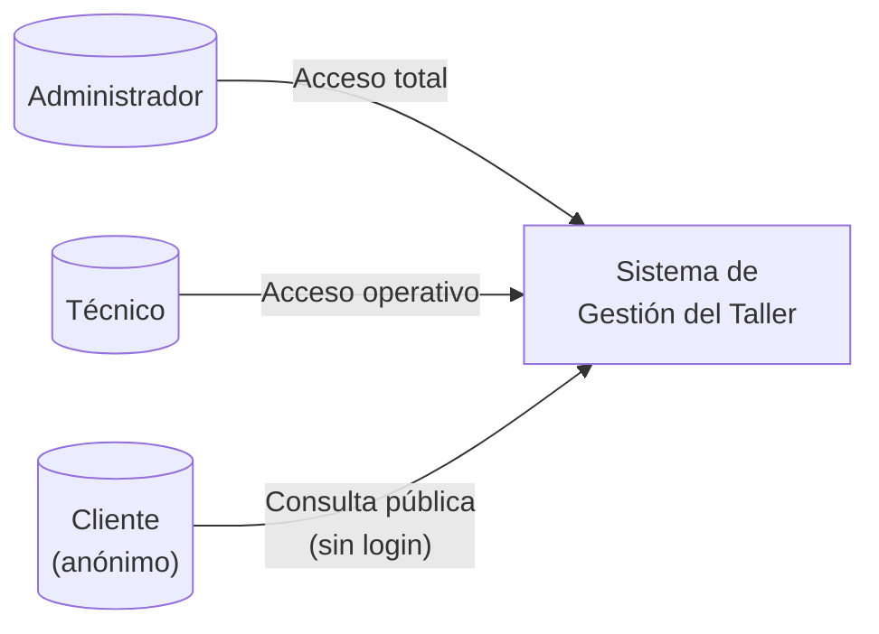
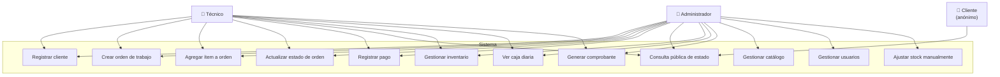
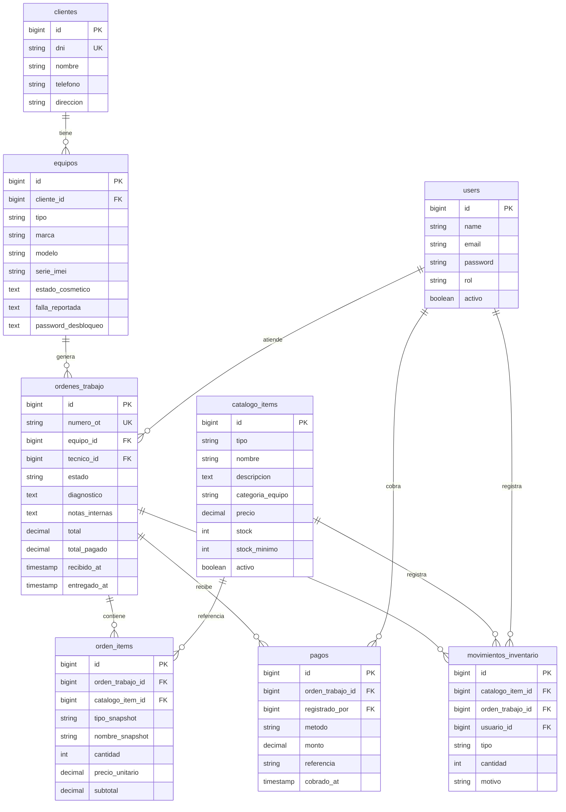
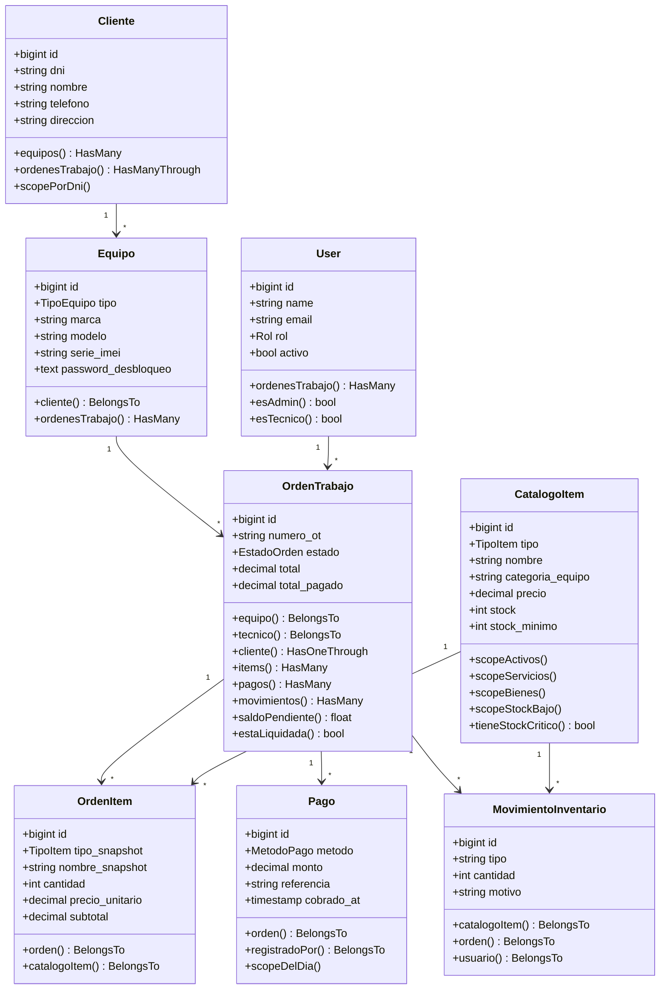
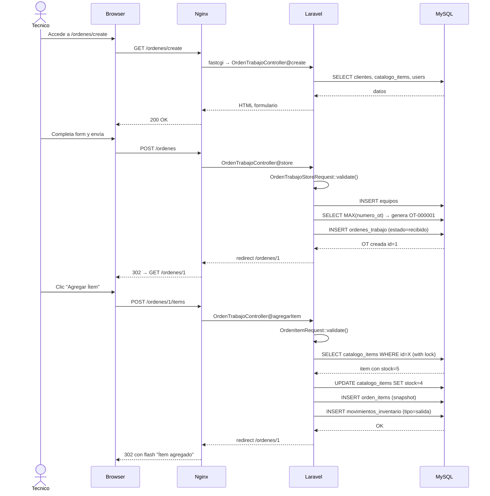
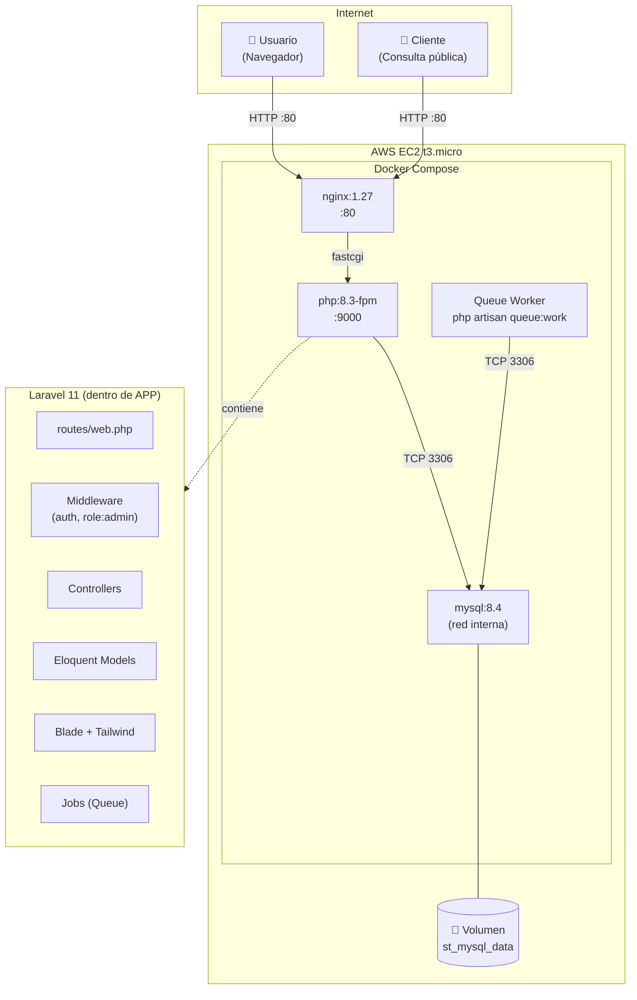
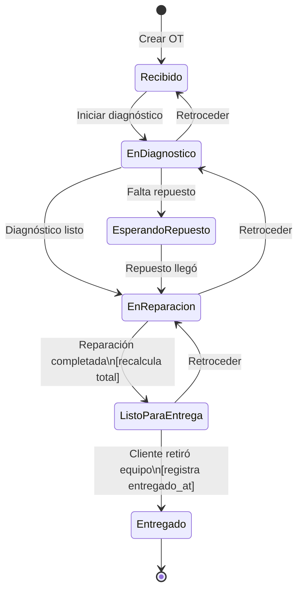

# Documentación Técnica
## Sistema de Gestión para Taller de Soporte Técnico y Venta de Repuestos

**Versión:** 1.0  
**Autor:** Franco Calle Castillo  
**Fecha:** Julio 2026  
**Estado:** MVP funcional desplegado en producción

---

## TABLA DE CONTENIDOS

1. [Descripción del Proyecto](#1-descripción-del-proyecto)
2. [Requerimientos Funcionales](#2-requerimientos-funcionales)
3. [Requerimientos No Funcionales](#3-requerimientos-no-funcionales)
4. [Actores del Sistema](#4-actores-del-sistema)
5. [Casos de Uso](#5-casos-de-uso)
6. [Diagramas](#6-diagramas)
   - 6.1 Diagrama de Casos de Uso
   - 6.2 Diagrama Entidad-Relación
   - 6.3 Diagrama de Clases (Modelos)
   - 6.4 Diagrama de Secuencia
   - 6.5 Diagrama de Componentes / Arquitectura
   - 6.6 Diagrama de Estados de la Orden de Trabajo
7. [Manual de Usuario](#7-manual-de-usuario)
8. [Glosario](#8-glosario)

---

## 1. DESCRIPCIÓN DEL PROYECTO

### 1.1 Nombre del sistema

**Sistema de Gestión para Taller de Soporte Técnico y Venta de Repuestos**

### 1.2 Contexto y motivación

Los talleres de reparación de equipos informáticos y celulares en el Perú operan mayoritariamente con registros manuales (cuadernos, hojas de cálculo) o con sistemas genéricos que no reflejan su flujo de trabajo real. Esta situación genera:

- Pérdida de información sobre el estado de los equipos en reparación
- Imposibilidad de que el cliente consulte el avance sin llamar al taller
- Falta de control sobre el inventario de repuestos
- Ausencia de registros contables del cierre de caja diario
- Exposición de datos sensibles (contraseñas de desbloqueo de dispositivos) sin cifrado

### 1.3 Objetivo general

Desarrollar un sistema web que digitalice y automatice la gestión operativa de un taller de soporte técnico: recepción de equipos, seguimiento de órdenes de trabajo, control de inventario, registro de pagos y consulta pública de estado.

### 1.4 Objetivos específicos

- Implementar un módulo de órdenes de trabajo con estados trazables y línea de tiempo
- Controlar el inventario de repuestos con alertas automáticas de stock mínimo
- Permitir al cliente consultar el estado de su equipo sin credenciales, mediante DNI
- Proteger datos sensibles (contraseñas de desbloqueo) mediante cifrado en base de datos
- Generar comprobantes de servicio imprimibles con detalle de trabajos y pagos
- Desplegar el sistema en la nube (AWS EC2) accesible desde cualquier dispositivo

### 1.5 Alcance del MVP

| Incluido | Excluido |
|----------|----------|
| Gestión de clientes y equipos | Módulo de proveedores |
| Órdenes de trabajo con 6 estados | Cotizaciones formales |
| Catálogo de servicios y repuestos | Facturación electrónica (SUNAT) |
| Control de inventario con movimientos | Integración con pasarelas de pago |
| Registro de pagos (4 métodos) | Notificaciones por WhatsApp / SMS |
| Caja diaria con desglose por método | App móvil nativa |
| Consulta pública por DNI / N° OT | Multi-sede |
| Comprobante imprimible | Reportes exportables a Excel |
| RBAC con 2 roles (Admin, Técnico) | |
| Despliegue en AWS EC2 | |

---

## 2. REQUERIMIENTOS FUNCIONALES

### RF-01 — Gestión de Clientes

El sistema debe permitir registrar, editar y dar de baja clientes con los siguientes datos:

| Campo | Tipo | Restricción |
|-------|------|-------------|
| DNI | Texto (8 caracteres) | Único, obligatorio |
| Nombre completo | Texto | Obligatorio |
| Teléfono | Texto | Obligatorio |
| Dirección | Texto | Obligatorio |

- El DNI debe ser único en el sistema; intentar registrar uno duplicado genera error de validación.
- La búsqueda de clientes debe funcionar por DNI parcial o completo.
- El administrador puede desactivar un cliente sin eliminarlo.

### RF-02 — Registro de Equipos

Al crear una orden de trabajo, el sistema registra el equipo asociado al cliente:

| Campo | Tipo | Notas |
|-------|------|-------|
| Tipo de equipo | Enum | Escritorio / Laptop / Celular |
| Marca | Texto | Obligatorio |
| Modelo | Texto | Obligatorio |
| Serie / IMEI | Texto | Opcional; etiqueta cambia según tipo (IMEI para celular, N° Serie para los demás) |
| Estado cosmético | Texto largo | Rasguños, golpes, estado visual al ingreso |
| Falla reportada | Texto largo | Descripción del problema según el cliente |
| Contraseña de desbloqueo | Texto | Opcional; se guarda **cifrada** en la BD |

### RF-03 — Control de Inventario

- El catálogo distingue dos tipos de ítems: **Servicios** y **Bienes** (repuestos).
- Solo los bienes tienen stock; los servicios tienen stock = 0 (mano de obra).
- Cada bien tiene un **stock mínimo** configurable.
- Al agregar un bien a una orden de trabajo, el sistema descuenta el stock automáticamente y registra el movimiento.
- El sistema alerta visualmente (badge rojo) cuando `stock ≤ stock_minimo`.
- El administrador puede registrar **entradas** y **ajustes** de inventario desde el módulo de Inventario.
- El técnico puede ver el inventario pero no modificarlo directamente (solo a través de órdenes).

### RF-04 — Órdenes de Trabajo

El ciclo de vida de una orden de trabajo sigue la siguiente línea de tiempo obligatoria:

```
Recibido → En Diagnóstico → Esperando Repuesto → En Reparación → Listo para Entrega → Entregado
```

- Los estados pueden avanzar o retroceder según el técnico lo requiera.
- Al pasar a **Listo para Entrega**, el sistema recalcula el total sumando todos los ítems.
- Al pasar a **Entregado**, se registra la fecha y hora de entrega.
- Cada orden genera un número único autoincremental con formato `OT-XXXXXX`.
- Una orden puede tener múltiples ítems (servicios y/o repuestos).
- Una orden puede tener múltiples pagos registrados.
- El campo `saldo_pendiente` se calcula como `total - total_pagado`.

### RF-05 — Registro de Pagos

- Una orden puede recibir pagos parciales o en un solo pago.
- Métodos de pago soportados: **Efectivo**, **Yape**, **Plin**, **Transferencia Bancaria**.
- Cada pago registra: monto, método, referencia (opcional), fecha/hora y usuario que lo registró.
- El `total_pagado` de la orden se actualiza acumulativamente con cada pago.

### RF-06 — Caja Diaria

- La sección de Caja muestra un resumen del día actual: total ingresado, desglose por método de pago, y listado de pagos individuales.
- Solo se muestran los pagos del día calendario actual (en zona horaria `America/Lima`).
- El administrador tiene acceso a la caja; el técnico también puede consultarla.

### RF-07 — Consulta Pública

- Sin necesidad de login, cualquier persona puede consultar el estado de un equipo.
- La búsqueda puede hacerse por **DNI del cliente** o por **número de OT**.
- El resultado muestra: número de OT, estado actual, línea de tiempo con fechas, marca y modelo del equipo, y diagnóstico (si existe).
- El resultado **NO** expone: teléfono, dirección, contraseña de desbloqueo, ni datos de pago.

### RF-08 — Generación de Comprobante

- Desde la vista de una orden, el sistema permite generar un comprobante de servicio imprimible.
- El comprobante incluye: datos del taller, datos del cliente, descripción del equipo, lista de servicios y repuestos con precios, total, pagos registrados y saldo pendiente.
- El comprobante puede visualizarse en HTML para impresión o descargarse como PDF.

### RF-09 — Control de Acceso por Roles (RBAC)

| Funcionalidad | Administrador | Técnico |
|--------------|:---:|:---:|
| Ver dashboard | ✓ | ✓ |
| Gestionar clientes (CRUD) | ✓ | ✓ |
| Gestionar órdenes (CRUD) | ✓ | ✓ |
| Agregar ítems a órdenes | ✓ | ✓ |
| Registrar pagos | ✓ | ✓ |
| Ver caja diaria | ✓ | ✓ |
| Consultar inventario | ✓ | ✓ |
| Gestionar catálogo (CRUD) | ✓ | ✗ |
| Ajustar inventario manualmente | ✓ | ✗ |
| Gestionar usuarios (CRUD) | ✓ | ✗ |
| Activar / desactivar usuarios | ✓ | ✗ |

### RF-10 — Gestión de Usuarios

- El administrador puede crear, editar y desactivar usuarios del sistema.
- Un usuario desactivado no puede iniciar sesión aunque recuerde su contraseña.
- Los roles disponibles son: **Administrador** y **Técnico**.

---

## 3. REQUERIMIENTOS NO FUNCIONALES

### RNF-01 — Rendimiento

- Las consultas principales (búsqueda por DNI, carga de orden de trabajo) deben responder en menos de **500 ms** bajo carga normal.
- Se implementan índices de base de datos en: `clientes.dni`, `ordenes_trabajo.numero_ot`, `ordenes_trabajo.estado`, `pagos.cobrado_at`.
- Se prohíbe el problema N+1: todos los controladores usan eager loading obligatorio con `with()`.

### RNF-02 — Seguridad

- Las contraseñas de usuario se almacenan con **bcrypt** (12 rondas).
- Las contraseñas de desbloqueo de equipos se almacenan con **AES-256-CBC** via `APP_KEY`.
- Todas las rutas protegidas requieren autenticación y verificación de rol.
- Se aplican headers de seguridad HTTP: `X-Content-Type-Options`, `X-Frame-Options`, `Referrer-Policy`.
- Protección CSRF activa en todos los formularios POST/PUT/DELETE.
- La consulta pública filtra explícitamente las columnas permitidas (`select()`) para evitar fuga de datos.

### RNF-03 — Disponibilidad

- El sistema debe tener una disponibilidad del **99%** en horario laboral (8:00 – 20:00, L–S).
- Los contenedores Docker tienen `restart: unless-stopped` para recuperación automática.

### RNF-04 — Privacidad de Datos

- La consulta pública nunca expone: teléfono, dirección, contraseña de desbloqueo, ni montos de deuda.
- Los datos de clientes son visibles únicamente para usuarios autenticados.

### RNF-05 — Usabilidad

- El sistema debe ser operable desde tablets y monitores de escritorio (diseño responsive con Tailwind CSS).
- El flujo de registro de una nueva orden de trabajo no debe requerir más de 3 pantallas.
- Los mensajes de error deben ser en español y orientados al usuario final.

### RNF-06 — Mantenibilidad

- El código sigue los estándares PSR-12 y convenciones de Laravel 11.
- Cobertura de tests automáticos para los flujos críticos (RBAC, consulta pública, inventario, caja).
- El entorno de desarrollo y producción son idénticos gracias a Docker Compose.

### RNF-07 — Portabilidad

- El sistema corre en cualquier entorno con Docker instalado, sin dependencias en el sistema operativo anfitrión.
- El despliegue en un servidor nuevo se completa ejecutando `./deploy.sh` tras clonar el repositorio.

---

## 4. ACTORES DEL SISTEMA



### 4.1 Administrador

Responsable de la operación completa del taller. Tiene acceso a todas las funcionalidades incluyendo la gestión del catálogo, usuarios y ajustes de inventario.

**Perfil típico:** dueño del taller o jefe de área.

### 4.2 Técnico

Opera el día a día: recibe equipos, crea órdenes, registra avances, agrega trabajos y cobra. No puede modificar el catálogo de precios ni administrar usuarios.

**Perfil típico:** técnico reparador con manejo básico de computadoras.

### 4.3 Cliente (anónimo)

No tiene cuenta en el sistema. Accede a la página pública para consultar el estado de su equipo usando su DNI o el número de orden que le entregaron al dejar el equipo.

**Perfil típico:** propietario del equipo en reparación.

---

## 5. CASOS DE USO

### CU-01: Registrar cliente

| | |
|---|---|
| **Actor principal** | Administrador / Técnico |
| **Precondición** | Usuario autenticado |
| **Flujo principal** | 1. Usuario accede a Clientes → Nuevo Cliente. 2. Completa el formulario (DNI, nombre, teléfono, dirección). 3. El sistema valida que el DNI sea único y que todos los campos requeridos estén completos. 4. El sistema guarda el cliente y redirige al listado con mensaje de éxito. |
| **Flujo alternativo** | Si el DNI ya existe, el sistema muestra error de validación sin guardar. |
| **Postcondición** | El cliente queda registrado y disponible para asociarse a órdenes de trabajo. |

### CU-02: Crear orden de trabajo

| | |
|---|---|
| **Actor principal** | Administrador / Técnico |
| **Precondición** | Usuario autenticado. El cliente debe estar registrado. |
| **Flujo principal** | 1. Usuario accede a Órdenes → Nueva Orden o desde la ficha del cliente. 2. Selecciona el cliente (búsqueda por DNI). 3. Completa los datos del equipo: tipo, marca, modelo, estado cosmético, falla reportada y contraseña de desbloqueo (opcional). 4. Opcionalmente asigna un técnico. 5. El sistema genera automáticamente el número de OT (OT-XXXXXX). 6. La orden inicia en estado **Recibido**. |
| **Postcondición** | Orden creada. Stock aún no modificado (los repuestos se agregan después). |

### CU-03: Agregar ítem a orden de trabajo

| | |
|---|---|
| **Actor principal** | Administrador / Técnico |
| **Precondición** | Orden existente. Si el ítem es un Bien, debe tener stock disponible. |
| **Flujo principal** | 1. Desde la vista de la orden, usuario selecciona "Agregar Ítem". 2. Elige el ítem del catálogo y la cantidad. 3. El sistema valida stock (si es Bien). 4. Guarda el ítem en la orden con snapshot de nombre y precio. 5. Si es Bien: descuenta el stock y registra un movimiento de salida en el historial de inventario. |
| **Flujo alternativo** | Si el stock es insuficiente, el sistema rechaza la operación con error. |
| **Postcondición** | El ítem queda en la orden. El stock del bien se ha decrementado. |

### CU-04: Actualizar estado de orden

| | |
|---|---|
| **Actor principal** | Administrador / Técnico |
| **Precondición** | Orden existente en cualquier estado distinto a Entregado. |
| **Flujo principal** | 1. Desde la vista de la orden, usuario selecciona el nuevo estado. 2. Si el nuevo estado es **Listo para Entrega**: el sistema recalcula y actualiza el total sumando todos los ítems. 3. Si el nuevo estado es **Entregado**: se registra la fecha/hora de entrega. 4. El sistema guarda el cambio. |
| **Postcondición** | El estado de la orden ha cambiado y es visible en la consulta pública. |

### CU-05: Registrar pago

| | |
|---|---|
| **Actor principal** | Administrador / Técnico |
| **Precondición** | Orden existente. El total debe ser mayor a cero. |
| **Flujo principal** | 1. Desde la vista de la orden, usuario hace clic en "Registrar Pago". 2. Ingresa monto, método de pago y referencia opcional. 3. El sistema valida que el monto sea positivo. 4. Crea el pago y actualiza `total_pagado` en la orden acumulativamente. |
| **Postcondición** | El pago queda registrado. El saldo pendiente de la orden se actualiza. |

### CU-06: Consulta pública de estado

| | |
|---|---|
| **Actor principal** | Cliente (anónimo) |
| **Precondición** | Ninguna. Acceso sin autenticación. |
| **Flujo principal** | 1. Cliente accede a la página principal del sistema. 2. Ingresa su DNI o el número de OT. 3. El sistema busca órdenes asociadas al DNI o la OT exacta. 4. Muestra: número de OT, estado actual, línea de tiempo con fechas, marca/modelo, diagnóstico (si existe). |
| **Flujo alternativo** | Si no se encuentran resultados, muestra mensaje informativo sin revelar si el DNI existe o no. |
| **Postcondición** | El cliente conoce el estado de su equipo sin exponer datos sensibles. |

### CU-07: Gestionar inventario

| | |
|---|---|
| **Actor principal** | Administrador |
| **Precondición** | Usuario autenticado con rol Administrador. |
| **Flujo principal** | 1. Administrador accede a Inventario. 2. Ve la lista de bienes con stock actual, mínimo y alertas. 3. Registra una **entrada** (llegó un pedido) o un **ajuste** (corrección de inventario físico). 4. El sistema actualiza el stock y registra el movimiento con motivo y usuario. |
| **Postcondición** | El stock del ítem ha sido actualizado y el movimiento queda en el historial. |

### CU-08: Ver caja diaria

| | |
|---|---|
| **Actor principal** | Administrador / Técnico |
| **Precondición** | Usuario autenticado. Deben existir pagos del día. |
| **Flujo principal** | 1. Usuario accede a Caja. 2. El sistema muestra: total del día, desglose por método (Efectivo, Yape, Plin, Transferencia), y listado de pagos individuales con OT, cliente, monto y método. |
| **Postcondición** | El usuario tiene el resumen financiero del día actual. |

### CU-09: Generar comprobante

| | |
|---|---|
| **Actor principal** | Administrador / Técnico |
| **Precondición** | Orden existente con al menos un ítem. |
| **Flujo principal** | 1. Desde la vista de la orden, usuario hace clic en "Ver Comprobante". 2. El sistema genera un documento HTML formateado para impresión. 3. El usuario puede imprimir desde el navegador o descargar como PDF. |
| **Postcondición** | El cliente recibe su comprobante físico o digital. |

---

## 6. DIAGRAMAS

### 6.1 Diagrama de Casos de Uso



### 6.2 Diagrama Entidad-Relación



### 6.3 Diagrama de Clases (Modelos Eloquent)



### 6.4 Diagrama de Secuencia — Crear Orden y Agregar Ítem



### 6.5 Diagrama de Arquitectura / Componentes



### 6.6 Diagrama de Estados — Orden de Trabajo



---

## 7. MANUAL DE USUARIO

### 7.1 Acceso al sistema

**URL del sistema:** `http://[IP o dominio del taller]/`

Para acceder al módulo de gestión interna, ir a `/login`:

| Campo | Valor |
|-------|-------|
| Correo electrónico | El asignado por el administrador |
| Contraseña | La asignada al crear la cuenta |

> **Nota:** Si tres intentos fallidos consecutivos ocurren, espera 1 minuto antes de reintentar.

---

### 7.2 Panel de Control (Dashboard)

Al iniciar sesión, el sistema muestra el panel de control con:

- **Órdenes activas hoy**: órdenes con estado diferente a Entregado creadas en los últimos 7 días
- **Conteo por estado**: cuántas órdenes están en cada fase
- **Alertas de inventario**: repuestos con stock igual o menor al mínimo configurado
- **Ingresos del día**: total cobrado hoy por todos los métodos

---

### 7.3 Módulo de Clientes

**Registrar un nuevo cliente:**

1. Menú lateral → **Clientes** → botón **Nuevo cliente**
2. Completar: DNI (8 dígitos), nombre completo, teléfono y dirección
3. Clic en **Guardar**

**Buscar un cliente:**

- En el listado de clientes, usar la barra de búsqueda por DNI o nombre

**Editar un cliente:**

- En el listado, clic en el ícono de lápiz o en el nombre del cliente
- Modificar los campos necesarios → **Guardar**

---

### 7.4 Módulo de Órdenes de Trabajo

#### Crear una nueva orden

1. Ir a **Órdenes** → **Nueva Orden**
2. **Seleccionar el cliente**: escribir el DNI en el campo de búsqueda
3. **Datos del equipo**:
   - Tipo: Escritorio / Laptop / Celular
   - Marca y modelo
   - Número de serie o IMEI (opcional)
   - Estado cosmético: describir rayones, golpes, daños visibles al ingreso
   - Falla reportada: exactamente lo que dice el cliente
   - Contraseña de desbloqueo: si el cliente la proporciona (se guardará cifrada)
4. **Técnico asignado**: opcional
5. Clic en **Crear Orden**

El sistema asignará automáticamente un número de OT (ej. `OT-000042`). Anota este número y dáselo al cliente como comprobante de ingreso.

#### Ver y gestionar una orden

Desde el listado de órdenes, clic en el número de OT para ver el detalle.

**Cambiar el estado:**
- Usar el selector de estado en la parte superior de la vista
- Confirmar el cambio

**Agregar un trabajo o repuesto:**
1. En la sección "Ítems", clic en **Agregar Ítem**
2. Seleccionar el servicio o repuesto del catálogo
3. Indicar la cantidad
4. Clic en **Agregar** — el stock del repuesto se descuenta automáticamente

**Agregar diagnóstico o notas:**
- Usar el botón **Editar** en la vista de la orden
- Las notas internas solo las ven los usuarios del sistema, no el cliente

#### Registrar un pago

1. En la vista de la orden, clic en **Registrar Pago**
2. Ingresar: monto, método de pago, referencia (ej. "Yape #1234")
3. Clic en **Guardar pago**
4. El saldo pendiente se actualiza automáticamente

#### Generar comprobante

1. En la vista de la orden, clic en **Ver Comprobante**
2. Se abre el comprobante formateado
3. Usar **Ctrl+P** (o Cmd+P en Mac) para imprimir o guardar como PDF

---

### 7.5 Módulo de Catálogo *(solo Administrador)*

El catálogo contiene los servicios y repuestos que se pueden agregar a las órdenes.

**Agregar un nuevo servicio:**
1. **Catálogo** → **Nuevo ítem** → Tipo: **Servicio**
2. Nombre, descripción, categoría de equipo (Escritorio / Laptop / Celular), precio
3. El campo stock queda en 0 (los servicios no tienen stock físico)

**Agregar un nuevo repuesto:**
1. **Catálogo** → **Nuevo ítem** → Tipo: **Bien**
2. Nombre, descripción, categoría, precio, stock inicial, stock mínimo
3. Definir el **stock mínimo**: cuando el stock llegue a ese valor, aparecerá la alerta roja

---

### 7.6 Módulo de Inventario *(administración de stock)*

El módulo de inventario muestra todos los bienes (repuestos) con su stock actual.

**Colores de alerta:**
- 🟢 Verde: stock normal
- 🔴 Rojo: stock igual o menor al mínimo configurado

**Registrar entrada de mercadería:**
1. **Inventario** → clic en **Registrar Movimiento**
2. Tipo: **Entrada**
3. Seleccionar ítem, cantidad y motivo (ej. "Pedido #45 llegó")
4. **Guardar** — el stock se incrementa automáticamente

**Registrar ajuste:**
1. Mismo proceso, pero tipo: **Ajuste**
2. La cantidad puede ser positiva (más stock) o negativa (corrección por pérdida)

---

### 7.7 Módulo de Caja

Acceder desde el menú lateral → **Caja**.

Muestra los ingresos del día actual:
- **Total del día**: suma de todos los pagos cobrados hoy
- **Por método**: desglose en columnas (Efectivo, Yape, Plin, Transferencia)
- **Detalle**: listado de cada pago con la OT asociada, cliente, monto, método y hora

> La caja solo muestra el día en curso. Para ver días anteriores, se requiere consultar la base de datos directamente.

---

### 7.8 Consulta Pública (para el cliente)

El cliente puede consultar el estado de su equipo desde cualquier dispositivo sin necesidad de registrarse.

**Pasos:**

1. Abrir el navegador e ir a la dirección del taller (ej. `http://[IP]/`)
2. En el formulario de consulta, ingresar:
   - **DNI** del propietario del equipo, **O**
   - **Número de OT** (ej. `OT-000042`) que le entregaron al dejar el equipo
3. Clic en **Consultar**

**Información que verá el cliente:**
- Número de OT y estado actual
- Línea de tiempo con las fechas de cada cambio de estado
- Marca y modelo del equipo
- Diagnóstico (si ya fue completado por el técnico)

**Información que NO se muestra al cliente:**
- Teléfono ni dirección (privacidad)
- Contraseña de desbloqueo
- Montos pendientes de pago

---

### 7.9 Gestión de Usuarios *(solo Administrador)*

1. Menú lateral → **Usuarios** → **Nuevo usuario**
2. Completar: nombre, correo, contraseña, rol (Administrador / Técnico)
3. El usuario podrá iniciar sesión inmediatamente

**Desactivar un usuario:**
- En el listado de usuarios, clic en **Editar** → cambiar el campo **Estado** a Inactivo
- El usuario desactivado no podrá iniciar sesión, pero sus datos históricos se conservan

---

## 8. GLOSARIO

| Término | Definición |
|---------|-----------|
| **OT** | Orden de Trabajo. Documento que agrupa toda la información de un equipo en reparación: cliente, equipo, diagnóstico, trabajos realizados, pagos. |
| **N° OT** | Número único de la orden de trabajo, generado automáticamente en formato `OT-XXXXXX`. |
| **Stock** | Cantidad de unidades disponibles de un repuesto en el inventario del taller. |
| **Stock mínimo** | Umbral de alerta configurado por el administrador. Cuando el stock llega a este valor, el sistema emite una alerta visual. |
| **Bien** | Ítem del catálogo que corresponde a un repuesto físico (ej. pantalla, memoria RAM). Tiene stock. |
| **Servicio** | Ítem del catálogo que corresponde a mano de obra (ej. mantenimiento, instalación de SO). No tiene stock. |
| **Snapshot** | Copia del nombre y precio de un ítem en el momento en que se agrega a la orden. Garantiza que si el precio del catálogo cambia después, el precio de la orden histórica no se altera. |
| **RBAC** | Role-Based Access Control. Sistema de control de acceso por roles. Cada usuario tiene un rol (Administrador o Técnico) que determina a qué funcionalidades puede acceder. |
| **IMEI** | International Mobile Equipment Identity. Número único de 15 dígitos que identifica un dispositivo móvil (celular). |
| **N° de Serie** | Número único asignado por el fabricante a cada equipo (laptops, escritorios). Equivalente al IMEI para dispositivos no móviles. |
| **Estado cosmético** | Descripción del estado físico visible del equipo al momento de ingreso al taller (rayones, golpes, piezas faltantes). Protege al taller de reclamos posteriores. |
| **Falla reportada** | Descripción del problema según lo narrado por el cliente al dejar el equipo. |
| **Diagnóstico** | Evaluación técnica realizada por el técnico tras examinar el equipo. |
| **Línea de tiempo** | Representación visual del historial de estados por los que ha pasado una orden de trabajo, con fecha de cada cambio. |
| **Caja diaria** | Resumen de todos los pagos cobrados durante el día calendario actual. |
| **Saldo pendiente** | Diferencia entre el total de la orden y lo que el cliente ya ha pagado. |
| **Docker** | Plataforma de contenerización que permite empaquetar el sistema y sus dependencias para ejecutarlo de forma idéntica en cualquier entorno. |
| **EC2** | Elastic Compute Cloud. Servicio de máquinas virtuales de AWS (Amazon Web Services). |
| **AES-256** | Estándar de cifrado simétrico de 256 bits usado para proteger datos sensibles (contraseñas de desbloqueo) en la base de datos. |
| **CSRF** | Cross-Site Request Forgery. Tipo de ataque web que el sistema previene mediante tokens únicos por sesión en todos los formularios. |
